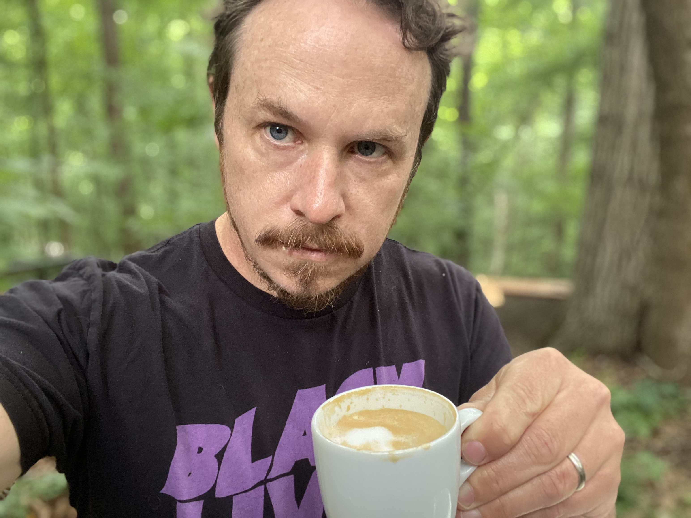

Hi, I'm Ben. I'm a data scientist and program evaluator living in Minneapolis, Minnesota with my wife and three boys.

By day I work at [Minnesota Management and Budget](https://mn.gov/mmb/) as a Results Coordinator — helping state government understand whether programs are working and what to do about it when they aren't. I've spent my career moving between research, evaluation, and data science across international development, federal agencies, and state government. The throughline has always been: *does this actually help people?*

Outside of work I'm into specialty coffee, writing poetry, and finding good places to sit and think. I take the coffee seriously enough to have opinions about milk texture. The poetry is quieter — you can find it in the poems section.

This site is where I put things I want to remember or share: coffee shop dispatches, occasional professional writing, and poems.

